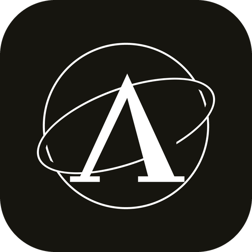

<p align="center">
  
</p>

<h1 align="center">AhoosAI Studio — Offline</h1>

<p align="center">
  Run AhoosAI's models on your own computer.<br>
  No account, no sign-in, and no internet after a one-time model download.
</p>

<p align="center">
  <a href="../../releases/latest"><b>Download</b></a> ·
  <a href="https://ahoos-ai.site/int-offline-studio">About the app</a> ·
  <a href="https://ahoos-ai.site/nimbus-2-apex-benchmarks.html">How the model was measured</a> ·
  <a href="https://huggingface.co/AhoosAI/nimbus-2-apex">Model on Hugging Face</a>
</p>

---

The model runs on your machine through
[llama.cpp](https://github.com/ggml-org/llama.cpp). Your conversations, the files
it writes and the folder you point it at never leave the computer. The only
network request the app ever makes is the one that downloads the model, once.

## The two models

They are not versions of each other. They sit on different base weights and were
trained for different things, and the app lets you switch between them in one
click.

**Nimbus 2 Apex** — an adapter over Qwen3-8B, trained to do as it is told.
Against the exact weights it was trained on, question by question in the same
session, instruction-following rises **8.7 points** and nothing else moves in a
way that survives a test of significance. That is the whole claim, at its real
size; the [benchmark page](https://ahoos-ai.site/nimbus-2-apex-benchmarks.html)
shows the losses as well as the gain.

It ships at three quarters strength. At full strength it writes longer than the
base model does, the thinking ceiling then cuts it off mid-thought, and an answer
that comes out of a severed reasoning is worse. Turning the adapter down removed
that, and cost no training at all.

**Nimbus 1.1 Prime-EE** — an adapter over Qwen2.5-Coder-7B-Instruct, trained out
of the habits a good programmer has anyway: a hard-coded `dir="ltr"`, a form
control with no label, a container that runs as root. It stays because it runs in
eight gigabytes of memory and Apex does not.

## What the app has

- **Two dials that mean something.** A thinking level from 1 to 20 — a word
  target the model was actually trained against, with a ceiling that closes the
  reasoning when the budget runs out. A temperature from 1 to 10, where each step
  is a whole sampling profile rather than one number moved.
- **Memory between messages**, off by default — four turns, or twelve.
- **A working folder**, chosen from your system's own dialog. Every path below it
  is resolved and then checked; one that climbs out is refused, not repaired.
- **A gate.** Before the model writes a file or runs a command you see exactly
  what will happen, and it does not happen until you say so. There is no list of
  forbidden commands: such a list looks like safety and is not.
- **A terminal** in that folder, and a button that opens your system's own there.
- **Plan or Normal.** In plan mode it writes down what it would do and waits.
- **Pictures.** An image is turned into an XML description of the scene, which the
  model reads as text — the weights are text-only and stay that way. It reads
  about half the charts put in front of it correctly and does not reliably know
  when it has the other half wrong, so check anything that matters.
- **English and Persian**, left-to-right and right-to-left.
- Conversations with their history, files saved to disk and never expired, effort
  levels, `@CR-file` for complete files instead of code in the chat, and skill
  chips you can create, import and switch.

**Not in the offline edition:** web search and team mode. Every message is
answered by the one model on your computer.

## Download

From [Releases](../../releases/latest):

| System | File |
|---|---|
| Windows 10 / 11 (64-bit) | `AhoosAI-Studio-…-windows-x64.zip` |
| macOS, Apple silicon | `AhoosAI-Studio-…-macos-arm64.dmg` |
| macOS, Intel | `AhoosAI-Studio-…-macos-x64.dmg` |
| Linux (64-bit) | `AhoosAI-Studio-…-linux-x64.tar.gz` |

Unpack it and run **AhoosAI Studio**. On first start it asks which model and
which size to download.

**Nimbus 2 Apex**, on Qwen3-8B:

| Size | Download | Memory |
|---|---|---|
| **apex_q4_k_m — recommended** | 5.0 GB | 12 GB |
| apex_q5_k_m | 5.9 GB | 16 GB |
| apex_q6_k | 6.7 GB | 20 GB |

**Nimbus 1.1 Prime-EE**, on Qwen2.5-Coder-7B-Instruct:

| Size | Download | Memory |
|---|---|---|
| q3_k_m | 3.8 GB | 8 GB |
| **q4_k_m — recommended** | 4.7 GB | 12 GB |
| q5_k_m | 5.4 GB | 16 GB |

Qwen publish no q3 of Qwen3-8B, so Apex starts at q4 and asks for more memory
than 1.1 does. Saying so is better than re-hosting a smaller build of somebody
else's weights to fill the gap.

The base model comes straight from Qwen's own repository on Hugging Face, resumes
if the connection drops, and is checked against its published checksum. Only our
adapter ships inside the package. After that first download the app needs no
internet.

Everything is stored in your user data folder: `%LOCALAPPDATA%\AhoosAI Studio` on
Windows, `~/Library/Application Support/AhoosAI Studio` on macOS,
`~/.local/share/AhoosAI Studio` on Linux. To keep it beside the program instead —
on a USB drive, say — put an empty file named `portable.txt` next to it.

## Security warnings on first run

AhoosAI Studio is not yet code-signed, so Windows and macOS may warn you before
it runs. The warning is about the missing signature, not about the app. Its
complete source is in this repository, it talks only to your own computer and —
for the one-time model download — to Hugging Face, and every release lists the
SHA-256 checksum of its files so you can confirm yours is the one published here.

- **Windows, "Windows protected your PC":** click **More info**, then **Run anyway**.
- **Windows 11 with Smart App Control on:** the app may be blocked outright, with
  no option to continue. This is Windows refusing any unsigned program; it will
  not run until the app is signed.
- **macOS, "cannot be opened because the developer cannot be verified":**
  right-click the app, choose **Open**, then **Open** again. Or allow it under
  System Settings → Privacy & Security.
- **Linux:** mark the program executable if your file manager asks
  (`chmod +x ahoos-studio`). Without WebKitGTK the studio opens in your browser
  instead of its own window, and works the same.

To check a download on Windows: `certutil -hashfile <file> SHA256`; on macOS or
Linux: `shasum -a 256 <file>`. Compare it with the checksum in the release notes.

## Building from source

```bash
pip install -r desktop/packaging/requirements.txt
python desktop/packaging/build.py
```

builds the package for the machine it runs on — PyInstaller freezes the
interpreter it runs under and llama.cpp's binaries are per platform, so none of
the three can be cross-built. `.github/workflows/desktop.yml` builds all four on
their own runners; pushing a tag like `desktop-v2.0.0` attaches them to a draft
release.

To work on the app without packaging it:

```bash
python -m desktop fetch-runtime                  # llama.cpp for this machine
python tools/adapter_to_gguf.py                  # the adapter
python -m desktop run --browser                  # the studio
python -m desktop run --engine echo --browser    # the interface, with no model
```

---

<div dir="rtl">

## فارسی

### اهوس‌ای‌آی استودیو، آفلاین

مدل‌های اهوس‌ای‌آی روی کامپیوتر خودتان. بدون حساب کاربری، بدون ورود، و بعد از یک
بار دانلود مدل بدون اینترنت.

مدل با [llama.cpp](https://github.com/ggml-org/llama.cpp) روی همان دستگاه اجرا
می‌شود؛ گفتگوها، فایل‌هایی که می‌نویسد و پوشه‌ای که به آن نشان می‌دهید از کامپیوتر
شما بیرون نمی‌روند. تنها درخواست شبکه‌ای که برنامه می‌زند، همان یک بار دانلود مدل
است.

### دو مدل

این دو نسخه‌های یک مدل نیستند؛ روی دو پایه‌ی متفاوت نشسته‌اند و برای دو کار متفاوت
آموزش دیده‌اند، و در برنامه با یک کلیک بینشان جابه‌جا می‌شوید.

**نیمبوس ۲ ایپکس** — آداپتوری روی Qwen3-8B، آموزش‌دیده برای اینکه دقیقاً همان کاری
را بکند که گفته شده. در برابر همان وزن‌هایی که رویشان آموزش دیده، پرسش‌به‌پرسش و در
یک نشست، دنبال‌کردن دستور **۸٫۷ واحد** بالا می‌رود و هیچ چیز دیگری آن‌قدر تکان
نمی‌خورد که از آزمون معناداری رد شود. ادعا همین است، به همین اندازه‌ی واقعی؛
[صفحه‌ی سنجش‌ها](https://ahoos-ai.site/nimbus-2-apex-benchmarks.html) باخت‌ها را هم
مثل بردها نشان می‌دهد.

با سه‌چهارم شدت منتشر می‌شود. با شدت کامل طولانی‌تر از مدل پایه می‌نویسد، سقف تفکر
وسط فکرش را می‌بُرد، و جوابی که از استدلال نصفه بیرون بیاید بدتر است. کم‌کردن شدت
آداپتور این مشکل را برداشت و هیچ آموزش تازه‌ای لازم نداشت.

**نیمبوس ۱٫۱ پرایم** — آداپتوری روی Qwen2.5-Coder-7B-Instruct، آموزش‌دیده روی
عادت‌هایی که یک برنامه‌نویس خوب به‌هرحال دارد: `dir="ltr"` دستی، فیلدی بدون برچسب،
کانتینری که با کاربر root اجرا می‌شود. می‌ماند چون در هشت گیگابایت حافظه اجرا
می‌شود و ایپکس نمی‌شود.

### برنامه چه دارد

- **دو دسته‌ی معنادار.** سطح تفکر از ۱ تا ۲۰ — همان هدف واژه‌ای که مدل با آن آموزش
  دیده، با سقفی که وقتی بودجه تمام شد استدلال را می‌بندد. دمای ۱ تا ۱۰، که هر پله‌اش
  یک پروفایل کامل نمونه‌برداری است نه یک عدد جابه‌جاشده.
- **حافظه بین پیام‌ها**، پیش‌فرض خاموش — چهار نوبت یا دوازده نوبت.
- **یک پوشه‌ی کاری**، از پنجره‌ی خود سیستم‌عامل. هر مسیری زیر آن اول باز و بعد بررسی
  می‌شود؛ مسیری که بیرون برود رد می‌شود، نه اینکه تعمیر شود.
- **یک دروازه.** قبل از اینکه مدل فایلی بنویسد یا دستوری اجرا کند، دقیقاً می‌بینید
  چه اتفاقی می‌افتد، و تا نگویید اتفاق نمی‌افتد. فهرستی از دستورهای ممنوع در کار
  نیست: چنین فهرستی شبیه امنیت است و امنیت نیست.
- **یک ترمینال** در همان پوشه، و دکمه‌ای که ترمینال خود سیستم را آنجا باز می‌کند.
- **حالت پلن یا عادی.** در حالت پلن می‌نویسد چه می‌خواست بکند و منتظر می‌ماند.
- **تصویر.** عکس پیش از رسیدن به مدل به توصیفی XML از صحنه تبدیل می‌شود و مدل آن را
  مثل متن می‌خواند — وزن‌ها فقط متنی‌اند و همان می‌مانند. حدود نیمی از نمودارها را
  درست می‌خواند و همیشه نمی‌فهمد که نیم دیگر را اشتباه خوانده، پس هرچه مهم است را
  خودتان بررسی کنید.
- **فارسی و انگلیسی**، راست‌به‌چپ و چپ‌به‌راست.
- گفتگوها با تاریخچه‌شان، فایل‌های ذخیره‌شده روی دیسک که منقضی نمی‌شوند، سطح‌های
  تلاش، `@CR-file` برای گرفتن فایل کامل به‌جای کد داخل چت، و چیپ‌های مهارت که
  می‌سازید، وارد می‌کنید و عوض می‌کنید.

**در نسخه‌ی آفلاین نیست:** جست‌وجوی وب و حالت تیمی. همه‌ی پیام‌ها را همان یک مدل روی
کامپیوتر شما جواب می‌دهد.

### دانلود

فایل سیستم‌عامل خود را از [Releases](../../releases/latest) بگیرید، باز کنید و
**AhoosAI Studio** را اجرا کنید. بار اول می‌پرسد کدام مدل و کدام اندازه دانلود
شود: ایپکس از ۵٫۰ تا ۶٫۷ گیگابایت، و ۱٫۱ از ۳٫۸ تا ۵٫۴ گیگابایت.

مدل پایه مستقیم از مخزن خود Qwen روی هاگینگ‌فیس می‌آید، اگر ارتباط قطع شود ادامه
می‌دهد، و با چک‌سام منتشرشده‌ی خودش بررسی می‌شود. فقط آداپتور ما داخل بسته است.
بعد از آن یک بار، اینترنت لازم نیست.

### هشدار امنیتی هنگام اجرا

برنامه هنوز امضای دیجیتال ندارد، برای همین ویندوز یا مک ممکن است هشدار بدهند.
هشدار به‌خاطر نداشتن امضاست، نه به‌خاطر خود برنامه: کد کاملش در همین مخزن است،
فقط با کامپیوتر خودتان و — برای آن یک بار دانلود — با هاگینگ‌فیس حرف می‌زند، و
چک‌سام SHA-256 هر فایل در توضیح ریلیز آمده تا مطمئن شوید فایلتان همان است که
اینجا منتشر شده.

- **ویندوز، «Windows protected your PC»:** روی **More info** و بعد **Run anyway** بزنید.
- **ویندوز ۱۱ با Smart App Control روشن:** ممکن است برنامه بدون گزینه‌ی ادامه بلاک
  شود. ویندوز هر برنامه‌ی بدون امضا را این‌طور رد می‌کند و تا امضا نشود اجرا نمی‌شود.
- **مک، «cannot be opened because the developer cannot be verified»:** روی برنامه
  راست‌کلیک کنید، **Open** و دوباره **Open** را بزنید.
- **لینوکس:** اگر فایل‌منیجر خواست، برنامه را اجراشدنی کنید (`chmod +x ahoos-studio`).
  بدون WebKitGTK استودیو به‌جای پنجره‌ی خودش در مرورگر باز می‌شود و همان‌طور کار می‌کند.

</div>

---

<p align="center">
  <sub>© ۲۰۲۶ AhoosAI · <a href="https://ahoos-ai.site">ahoos-ai.site</a></sub>
</p>
